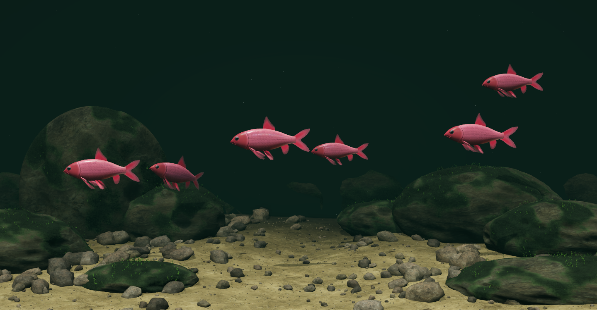

# Desktop Habitats（桌面栖息地）

[English](README.md) · **简体中文**

[](docs/videos/demo.mp4)

你是不是一直想要一个水族箱？现在可以把它放在桌面上 :)

鱼会对你的光标做出反应，也会为食物争抢；水草在缓慢的水流里摇摆。有三个环境：**Riverscape（河景缸）**，一个种满水草的淡水缸；**Reefscape（礁岩缸）**，一个海水缸；**Streamscape（溪流缸）**，以圆卵石和浅色砾砂为底，六条红吉罗在清澈水流中顶流游动。


场景用 Three.js 和 WebGL2 实时渲染。一切都在本机运行，装好之后不需要账号、也不需要联网。桌面壁纸目前**只支持 macOS**；三个环境也都能在浏览器里跑。Mac 应用启动时是 Riverscape，并会记住你在菜单里选择的环境。



## 在 Mac 上安装

需要 macOS 13 或更高版本，以及 Xcode 命令行工具。安装工具请在「终端」里运行：

```sh
xcode-select --install
```

等安装结束后，下载并解压本仓库（或者克隆它），然后在项目目录里打开「终端」运行：

```sh
sh wallpaper/install.sh
```

脚本会为你的 Mac 编译应用，安装到 `~/Applications/Desktop Habitats.app` 并启动它。它还会加入一个登录项，这样你登录后水族箱会自动运行。第一帧大约需要 20 秒才会出现。

安装过程中，macOS 可能会询问「终端」是否可以控制 System Events。这是为了让安装脚本把水族箱的一帧静帧设成你的桌面图片，垫在动画图层下面。你可以拒绝，动态壁纸仍然可用。

壁纸本身不需要 Node.js。如果你已经装了，`npm run wallpaper` 会运行同一个安装脚本。

## 使用壁纸

点击菜单栏里的鱼图标：

- **Environment（场景）**：在河景缸、礁岩缸和溪流缸之间切换所有屏幕，并记住你的选择。
- **Feed（喂食）**：河景缸投入十粒鱼食，礁岩缸八粒，溪流缸六粒。河景缸没被吃掉的鱼食会在模拟时间 20–40 秒后溶解，礁岩缸是 36 秒。溪流缸每条红吉罗各吃一粒顺流漂移的鱼食，然后回到巡游路线。
- **Pause / Resume（暂停 / 继续）**：控制动画。你的选择在重启后仍然保留。
- **Quit（退出）**：关闭应用，直到你再次打开或下次登录。

把光标移到鱼附近就能看到它们反应。桌面图标、点击和拖拽都照常使用。喂鱼请用菜单；点击桌面不会投放鱼食。

## 常见问题

### 支持 Windows 或 Linux 吗？

桌面应用只支持 macOS。浏览器预览需要一个支持 WebGL2 的浏览器，Windows 和 Linux 上没有壁纸安装脚本。

### 会消耗我的电池吗？

比静帧壁纸耗电，因为它要渲染 3D 场景。具体多少取决于你的 Mac、屏幕分辨率和显示器数量。目前还没有实测的续航数据。

三个场景用同一套质量档位，并在暂停或隐藏时停止渲染。壁纸还会响应窗口遮挡、电池供电、低电量模式和屏幕休眠。

壁纸运行的是 Detail 档。按桌面状态，帧率上限是：

| 桌面状态 | 帧率 |
| --- | --- |
| 完全可见，接通电源 | 最高 60 fps |
| 完全可见，使用电池 | 最高 30 fps |
| 大部分被窗口遮挡 | 最高 20 fps |
| 几乎完全被遮挡 | 停止 |
| 低电量模式、屏幕锁定或休眠 | 停止 |

想要静止的水族箱，可以从菜单里暂停；想彻底关闭应用就选退出。浏览器预览提供 Eco、Balanced 和 Detail 三档；实际帧率取决于设备和场景。续航尚未实测。

### 它会监控我的键盘输入吗？

不会。壁纸不监听其他应用里的输入，也不记录按键。三个浏览器预览在水族箱获得焦点时支持空格键暂停/继续、F 键全屏、H 键隐藏或显示控制栏。

壁纸会读取你的光标位置，好让鱼做出反应。它也会读取窗口的位置和尺寸，用来估算桌面有多少是可见的。它不会捕获这些窗口的内容，不保存光标历史，也不会把这些信息发到任何地方。

### 需要联网或特殊权限吗？

安装之后，水族箱完全离线运行。它的代码、贴图和 Three.js 库都打包在应用里。没有任何分析统计或外部服务。

应用不申请辅助功能、输入监控或屏幕录制权限。安装过程中那个可选的 System Events 询问，是用来更换静态桌面图片的。

### 为什么鱼不动了？

打开鱼的菜单可以看到当前状态。壁纸在几乎完全被遮挡、处于低电量模式、以及屏幕锁定或休眠时会停止。

如果 macOS 里开启了「减弱动态效果」，水族箱会以暂停状态启动，除非你之前已经保存过其他选择。选 **Resume（继续）** 让它动起来。低电量模式必须先关闭，动画才能恢复。

### 可以用多显示器吗？

可以。每个显示器都有自己的水族箱，**Feed（喂食）** 会在所有显示器上投放鱼食。每个缸单独渲染，所以显示器越多，耗电可能越高。

### 需要一直开着「终端」吗？

不需要。安装好的应用自带一份场景副本，独立运行。安装结束后你就可以关掉「终端」。

### 怎么更新？

下载或拉取最新源码，然后在项目目录里重新运行 `sh wallpaper/install.sh`。只改源码不会更新已安装的应用。如果你装过更早的 Aquatica 版本，安装脚本会先移除它的应用和登录项，再启动 Desktop Habitats。它留下的旧静帧图片和保存的偏好不会被清理；新应用会用自己的偏好启动。

### 怎么卸载，怎么拿回我原来的壁纸？

在项目目录里运行：

```sh
sh wallpaper/uninstall.sh
```

或者用 `npm run unwallpaper`。这会停止应用、移除它的登录项并删除已安装的应用。

`~/Pictures/Desktop Habitats.png` 这张静帧图片会留下，桌面图片设置也会保留。在「系统设置」里选回你原来的壁纸；如果不想要这张图，再自行删除。已保存的暂停状态和环境偏好同样会保留。

## 在浏览器里试试

需要 Node.js 20 或更高版本，在项目目录里运行：

```sh
npm start
```

打开[本地预览](http://127.0.0.1:8080)。不需要 `npm install`，库已经包含在内。如果 8080 端口被占用，用 `PORT=8081 npm start`；按 Ctrl+C 停止服务器。

- 点击水面投放鱼食。
- 把指针移到鱼附近进行互动。
- 滑动或滚动浏览画廊，也可以用左右方向键。点开图片或名字进入某个场景。
- 三个场景都有 **Pause / Resume（暂停/继续）**、**Feed（喂食）**、**Fullscreen（全屏）** 和 **Hide controls（隐藏控制栏）**。**Show controls** 把控制栏调回来。
- 按 **空格** 暂停或继续，**F** 全屏，**H** 在水族箱获得焦点时隐藏或显示控制栏。
- **Quality（画质）** 提供 Eco（20 fps）、Balanced（30 fps，默认）和 Detail（60 fps）。这个选择在三个场景之间共享并被记住。这些是帧率上限；更低的档位同时也会降低渲染分辨率。

「减弱动态效果」会让预览以暂停状态启动。请通过 HTTP 提供页面；直接打开 `index.html` 不会加载它的 JavaScript 模块。任何静态服务器都可以，比如装了 Python 的话可以用 `python3 -m http.server 8080 --bind 127.0.0.1`。

## 致谢与许可

Desktop Habitats 采用 [MIT 许可](LICENSE)。Three.js 0.180.0 以它的 [MIT 许可](vendor/THREE-LICENSE.txt) 一同分发。

岩石、木头和沙子的贴图来自 Poly Haven，采用 [CC0](https://polyhaven.com/license)：[Rock Boulder Dry](https://polyhaven.com/a/rock_boulder_dry)、[Rough Wood](https://polyhaven.com/a/rough_wood) 和 [Sand 01](https://polyhaven.com/a/sand_01)。Reefscape 的岩石网格、孔隙贴图、珊瑚贴图和生物网格都是程序化生成的，由 `tools/` 里的脚本产出。
